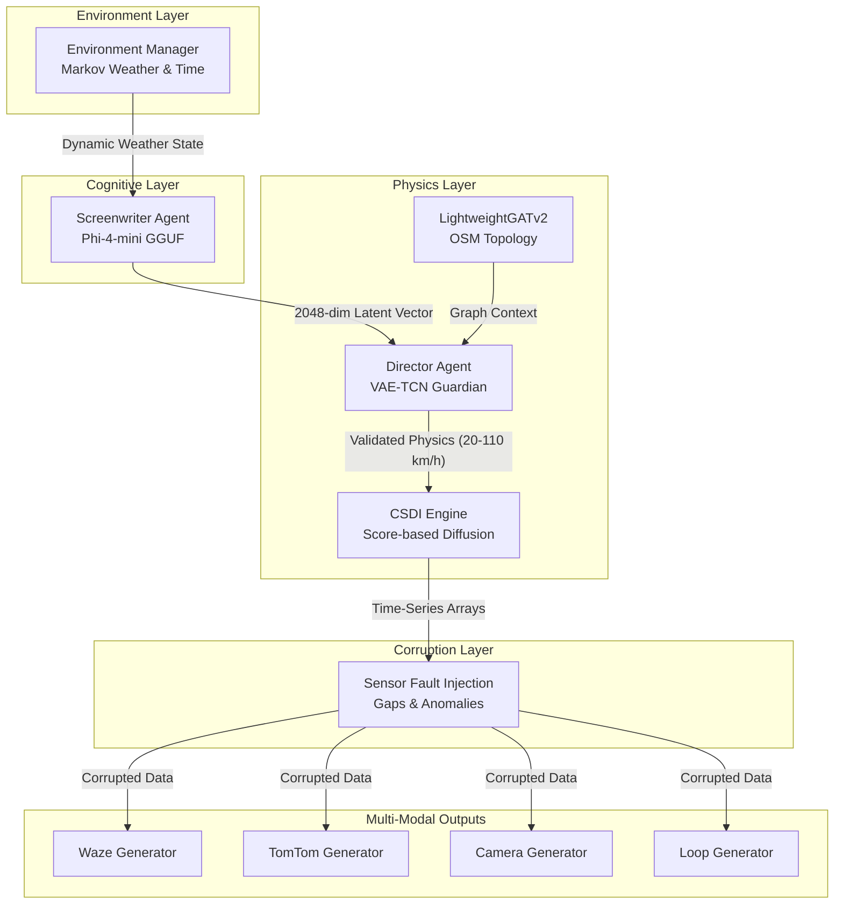
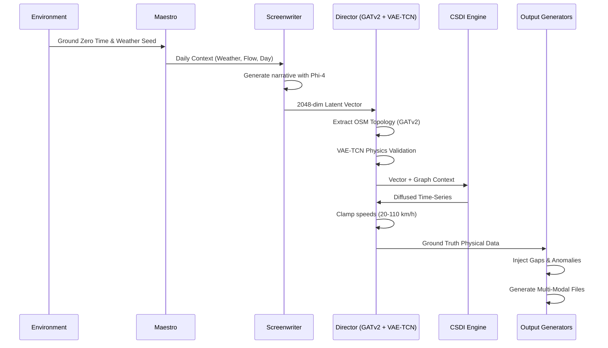

# SYNTHETIC

**An AI-Orchestrated Engine for Multi-Modal Traffic Scenario Synthesis**

---

## Overview

SYNTHETIC is an enterprise-grade synthetic data engine engineered to simulate high-fidelity, multi-modal traffic scenarios. Moving beyond deterministic simulations and static mathematical models, SYNTHETIC employs a Hybrid Generative AI Architecture that creates synergy between Small Language Models (SLM) for strategic planning, Graph Attention Networks (GATv2) for spatial topology, and Score-based Diffusion Models (CSDI) for precise physical execution.

The system delivers strictly coherent and realistic datasets for Intelligent Transportation Systems (ITS) training, validation, and stress-testing.

---

## Purpose

SYNTHETIC was developed to address a critical gap in traffic simulation: the lack of realistic, multi-modal datasets that capture both the physical accuracy of ground truth data and the imperfections of real-world sensor observations.

| Challenge            | SYNTHETIC Solution                                           |
| -------------------- | ------------------------------------------------------------ |
| Deterministic Models | Generative AI architecture with non-linear behavior          |
| Single-Modal Data    | Synchronized multi-modal outputs (Waze, TomTom, Camera, Loop) |
| Perfect Sensor Data  | Configurable corruption layer (gaps, anomalies, noise)       |
| Static Scenarios     | SLM-driven dynamic narrative generation                      |
| Physics Violations   | VAE-TCN physics guardian validation & hard physical clamps   |
| Spatial Ignorance    | GATv2 topographical OpenStreetMap (.osm) adherence           |

---

## Architectural Philosophy

The core philosophy of SYNTHETIC is the strict separation between **Ground Truth Physics** and **Sensor Perception**, governed by the Single Responsibility Principle (SRP). 

In the real world, physics does not fail. Vehicles do not teleport, and inertia is never broken. However, the sensors observing these physics (cameras, GPS, inductive loops) fail constantly. SYNTHETIC models this reality by first generating a mathematically perfect physical simulation, grounded by real-world map data and meteorological physics, then deliberately corrupting the observation of that simulation before saving the data.



---

## System Architecture

SYNTHETIC operates through a highly specialized intelligence system divided into distinct layers:

### 1. Environment Layer

| Component          | Function                                                     | Technology        |
| ------------------ | ------------------------------------------------------------ | ----------------- |
| EnvironmentManager | Manages time logic and realistic Markov-chain weather evolution | Python Native     |

### 2. Cognitive Layer

| Component          | Function                                                     | Technology        |
| ------------------ | ------------------------------------------------------------ | ----------------- |
| Screenwriter Agent | Generates macro-level narrative context for each simulation day | Phi-4-mini GGUF   |
| Maestro            | Central orchestration, threading, and resource management    | Python Native     |

### 3. Physics Layer

| Component      | Function                                                     | Technology        |
| -------------- | ------------------------------------------------------------ | ----------------- |
| GATv2          | Extracts spatial nodes/edges from `.osm` to bound generation | PyTorch Geometric |
| Director Agent | Validates physics and enforces hard speed clamps (20-110 km/h) | VAE-TCN + PyTorch |
| CSDI Engine    | Generates realistic flow and speed matrices                  | Diffusion Models  |
| HyperTuner     | Just-in-time AutoML optimization                             | Optuna            |

### 4. Corruption & Output Layer

| Generator        | Type              | Format | Simulates                                   |
| ---------------- | ----------------- | ------ | ------------------------------------------- |
| Waze Generator   | Global Navigation | JSON   | Crowdsourced GPS + ETA + Jam Levels         |
| TomTom Generator | Global Navigation | JSON   | Fleet commercial tracking + Flow Segment    |
| Camera Generator | Local Sensor      | JSON   | LPR/OCR visual detection + License Plates   |
| Loop Generator   | Local Sensor      | CSV    | Electromagnetic inductive loops + Occupancy |

*Note: Fault injection runs prior to generation, applying 3-15% hardware dropouts and 3-5% speed/flow noise multipliers.*

---

## Data Generation Flow



---

## Traffic Flow Levels

SYNTHETIC operates in four distinct traffic density regimes:

| Level   | Base Amplitude | Free Flow Speed | Behavior                            |
| ------- | -------------- | --------------- | ----------------------------------- |
| Small   | 30 vehicles    | 80 km/h         | Low-density suburban traffic        |
| Medium  | 120 vehicles   | 70 km/h         | Standard urban traffic              |
| Large   | 250 vehicles   | 60 km/h         | High-density city traffic           |
| Chaotic | 600 vehicles   | 50 km/h         | 70-90% saturation, 3-15 km/h speeds |

---

## Key Technical Features

| Feature              | Description                                                  |
| -------------------- | ------------------------------------------------------------ |
| Spatial Adherence    | Supports `.osm` (OpenStreetMap) ingestion to algorithmically snap generated events to actual city topologies. |
| PT-BR Localization   | The entire user interface (`tkintermapview`) is fully localized to Brazilian Portuguese for enhanced regional usability. |
| Markov Weather       | Decoupled state machine simulating non-abrupt, logical weather evolution over multi-day simulations. |
| Temporal Ground Zero | All simulations anchor to Monday 00:00:00 for weekly cyclical consistency. |
| Physics Clamping     | A baseline mathematical offset ensuring no vehicles travel at unphysical near-zero speeds without explicit jams. |

---

## Output Structure

Generated data is organized in a hierarchical structure for easy ingestion by ML pipelines:

```
output/
└── YYYY-MM-DD_HH-MM-SS/
    ├── waze/
    │   └── waze_feed_*.json
    ├── tomtom/
    │   └── tomtom_flow_*.json
    ├── camera/
    │   ├── cam_01/
    │   │   └── cam_01_*.json
    ├── loop/
    │   ├── loop_01/
    │   │   └── loop_01_*.csv
```

---

## System Requirements

| Component        | Minimum                     | Recommended                   |
| ---------------- | --------------------------- | ----------------------------- |
| Python           | 3.10+                       | 3.11+                         |
| RAM              | 8 GB                        | 16 GB+                        |
| Storage          | 5 GB free                   | 50 GB+ SSD                    |
| GPU              | Optional                    | NVIDIA 6GB+ VRAM (CUDA 11.8+) |
| Operating System | Windows 10/11, Linux, macOS | Windows 11 or Linux           |

---

## Usage

### Installation

1. Clone the repository
2. Create a Python virtual environment (`python -m venv .venv`)
3. Install dependencies: `pip install -r requirements.txt`
4. Ensure `Phi-4-mini-reasoning-UD-Q6_K_XL.gguf` is placed inside `src/models/vault/`

### Execution

SYNTHETIC utilizes a robust, map-integrated UI localized in PT-BR:

1. Execute `python main.py`
2. Define the output directory and select a valid `.osm` map file representing your target city block.
3. Configure settings: Data Sources, Gaps/Anomalies, Duration, Interval, and Flow Level (Pequeno, Médio, Grande, Caótico).
4. Click **SELECIONAR NO MAPA** to open the interactive map view.
5. Click directly on the map to place your requested Sensors (Cameras/Loops).
6. Confirm selection to begin the AI orchestration background loop.

---

## License

SYNTHETIC is distributed under the **Apache License, Version 2.0**.

This software is intended as a research and testing tool for Intelligent Transportation Systems development. All components are licensed under Apache 2.0 to facilitate academic and commercial research use.

---

## Contact

| Channel      | Details                                     |
| ------------ | ------------------------------------------- |
| Project Lead | Gabriel Moraes                              |
| Organization | Noxfort Systems                             |
| Email        | gabriel.moraes@noxfortsystems.com           |
| Website      | https://noxfortsystems.com                  |
| Issues       | GitHub Issues for bugs and feature requests |
| Discussions  | GitHub Discussions for questions and ideas  |

---

## About Noxfort Systems

Noxfort Systems is a deeptech company focused on AI-driven simulation infrastructure for critical urban systems. SYNTHETIC represents our commitment to delivering strictly coherent, realistic datasets for the Intelligent Transportation Systems ecosystem.

---

<div align="center">

[](https://opensource.org/licenses/Apache-2.0)
[](https://www.python.org/downloads/)
[](https://www.python.org/)
